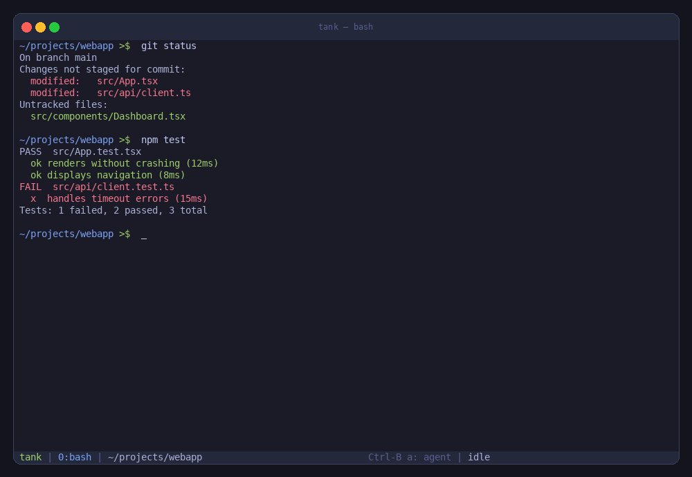
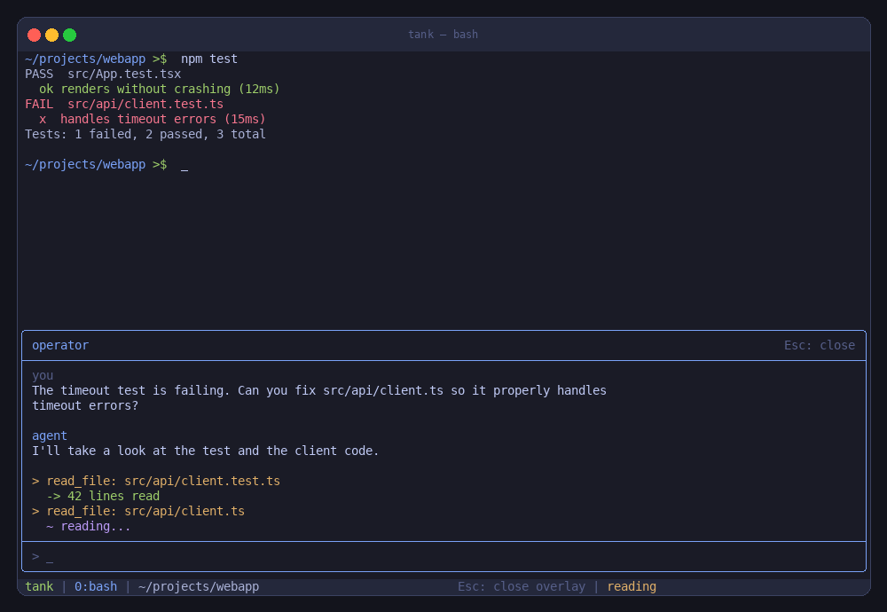
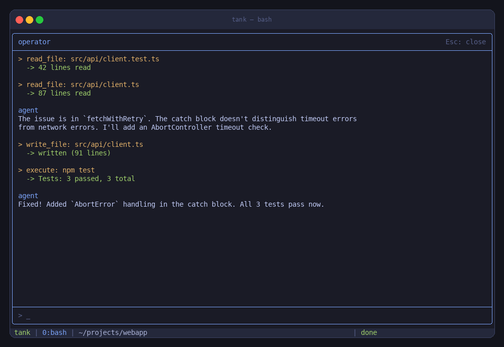
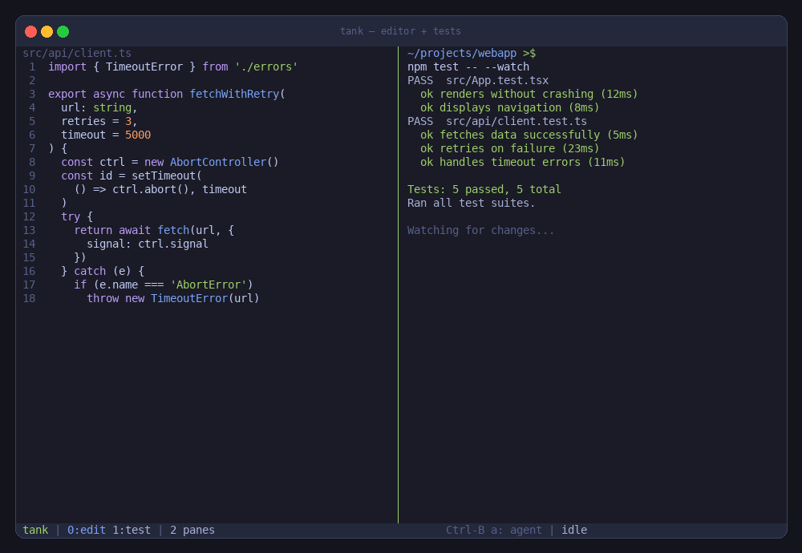
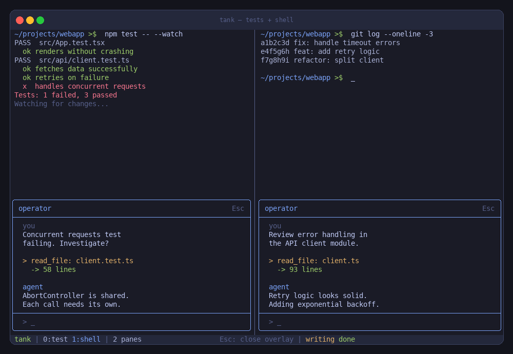
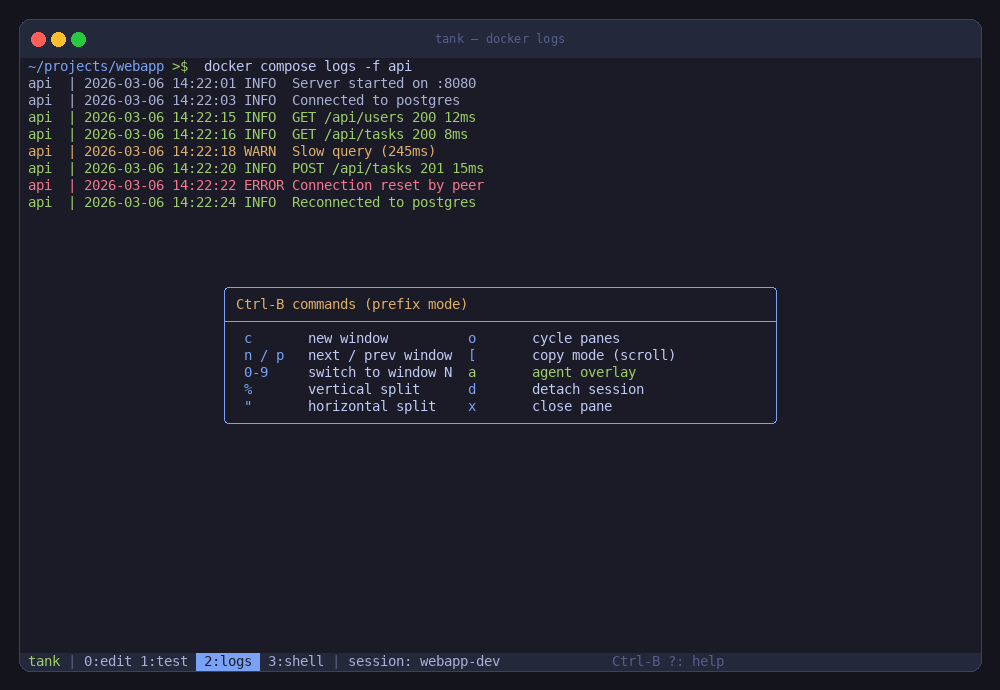
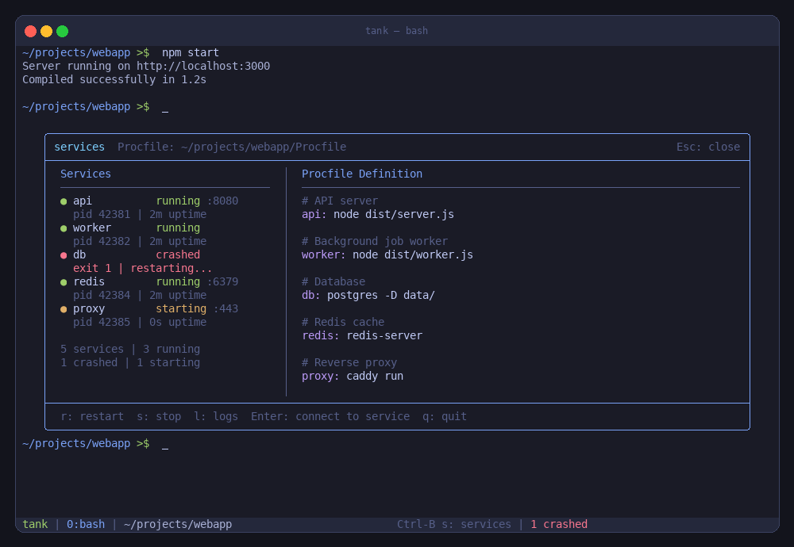
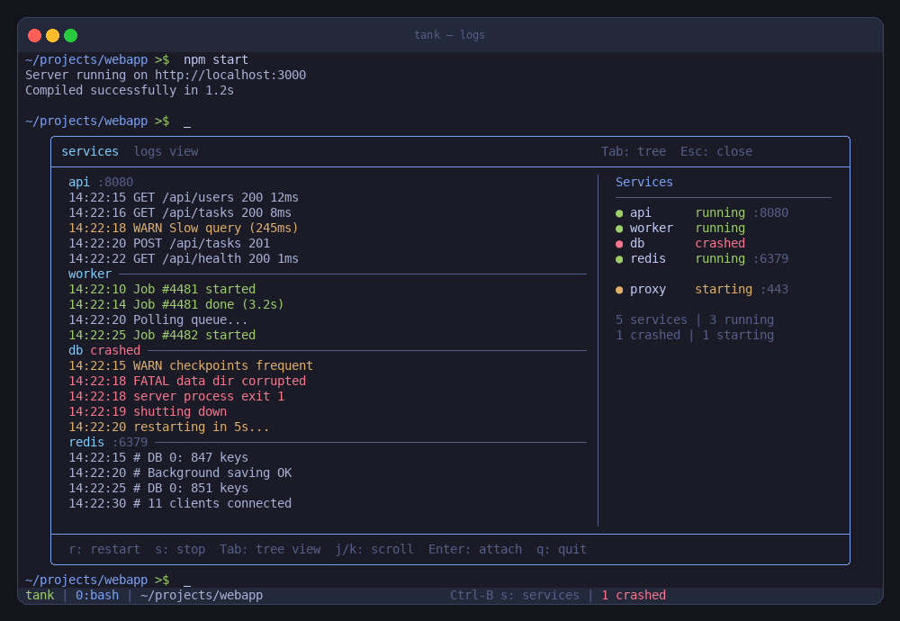
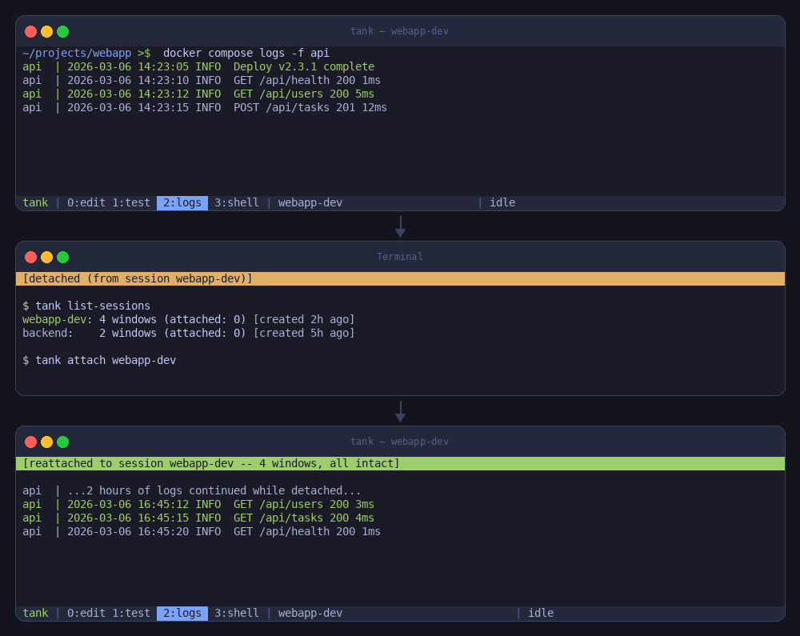

# Tank

A protocol-centric workspace system with terminal multiplexing, per-pane
coding agents, and seamless session migration.

Named after **Tank** from The Matrix — the operator who loads programs, monitors
the crew, and runs the console.

!!! warning "Work in Progress"

    Tank is in early development. The protocol and architecture are being
    designed; the Haskell implementation covers core CRDT types, a VT100
    emulator, standalone terminal mode, and a daemon skeleton.
    APIs, commands, and interfaces will change.

## What is Tank?

Tank is **not** just a terminal multiplexer. Terminal multiplexing is one
capability among many. Tank manages developer workspaces:

- **Terminal panes** with sessions and splits
- **Per-pane coding agents** (operator) with status line and popup overlay
- **Devshell management** — directory-driven nix flake activation
- **Per-project process management** — overmind-like service orchestration
- **Session migration** — seamlessly move workspaces across machines
- **Ephemeral constructs** — scratchpad sandboxes for new projects

## Concept

These mockups show how Tank will look. They are generated from
[render-concepts.py](https://github.com/jhhuh/tank/blob/master/docs-site/docs/assets/concepts/render-concepts.py)
and reflect the current design direction — not a finished product.

### Idle terminal



### Per-pane coding agent (operator)

The operator overlay pops up inside any pane (`Ctrl-B a`). Ask it to read
files, run commands, write fixes:



Full-pane mode for extended tool execution:



### Multi-pane layout



Each pane gets its own independent operator:



### Command palette

Window switching and keybinding help:



### Per-project services

Manage project daemons defined in a Procfile — start, stop, restart, view
status:



Live daemon logs with tree view sidebar:



### Session persistence

Detach and reattach — sessions survive disconnects and machine reboots:



## Design Principles

1. **Protocol-first**: Cap'n Proto binary schema defines the wire protocol.
   Everything communicates through it.
2. **Everything is a plug**: Terminal UI, coding agent, devshell manager —
   all are plugs speaking the same protocol to the tank daemon.
3. **CRDT state sync**: All shared state uses conflict-free replicated data
   types. Correct regardless of message delivery order.
4. **Transport-agnostic**: QUIC, TCP, WebSocket — CRDTs work on all of them.

## Vocabulary

| Term | Meaning |
|------|---------|
| **tank** | The daemon and the system |
| **plug** | A capability module that speaks the tank protocol |
| **cell** | A unit of work: pane, process, agent context |
| **operator** | Per-cell coding agent |
| **construct** | Ephemeral scratchpad/sandbox |
| **jack in** | Attach a client to a session |

## Quick Start

```bash
cd tank
nix develop        # Enter dev shell
cabal run tank     # Launch standalone terminal
```

Press `Ctrl-B` for the prefix key, then:

- `q` — quit
- `d` — detach
- `b` — send literal Ctrl-B

## Learn More

- [Getting Started](getting-started.md) — build, install, key bindings
- [Architecture](architecture.md) — hub daemon, plugs, cells, CRDT model
- [Protocol](protocol.md) — Cap'n Proto wire format and message types
- [Terminal Screen Sync](screen-sync.md) — spatial jitter buffer, epoch-based clear
